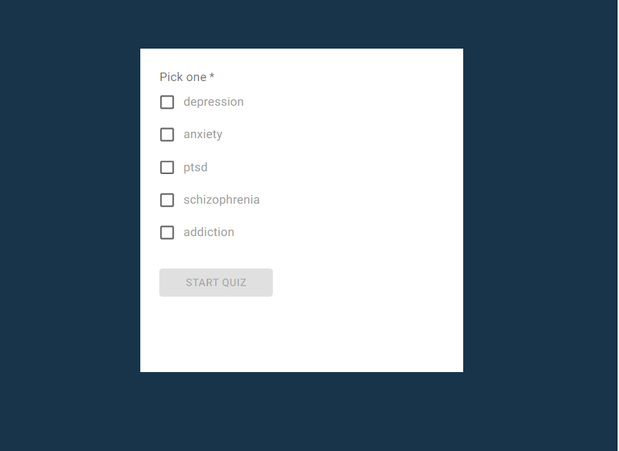
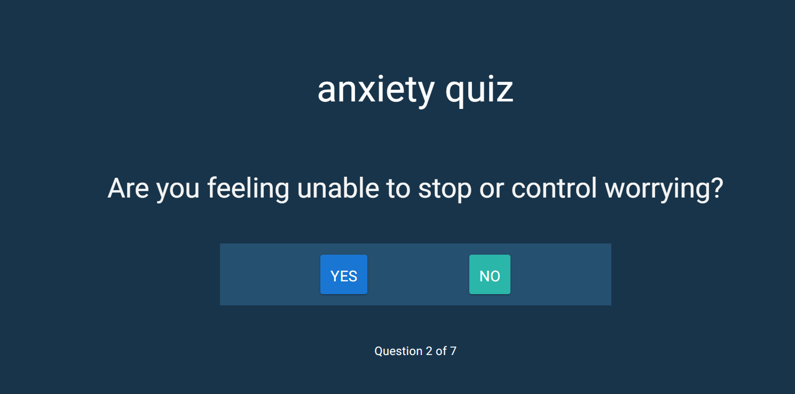
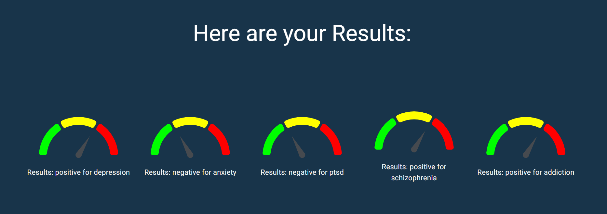

# Mental Health Check

## Description

A mental health quiz app that helps users track their moods using standardized screening tests. Mental Health Check tests users with multiple quiz options to help users understand and identify their feelings. The app is a Progressive Web Application including the ability to take and save quiz results offline. The application uses a React.js front-end with MongoDB and Express.js running the back-end and Node.js as the package manager.

## Table of Contents

- [Overview](#overview)
- [Features](#features)
- [Installation](#Installation)
- [Usage](#Usage)
- [Questions](#Questions)
- [License](#License)

## Overview

Mental Health Check is a quiz app that helps users identify their feelings and directs them to helpful resources.

## Features

- Create an account to take your quiz today
- Science-backed questions create an approachable app to help identify your feelings and direct you to useful resources
- View previous quiz results by logging in

## Installation

Please install Node.js and MongoDB prior to installing the application.

[Node.js](https://nodejs.org/en/download)  
[MongoDB](https://www.mongodb.com/docs/manual/administration/install-community/)

Use the .env.example file to ensure proper database setup. Replace the environment variables with your MongoDB connection string.

`npm install`

## Usage

`npm run develop`

## Preview

#### Landing

#### Quiz

#### Quiz Results

